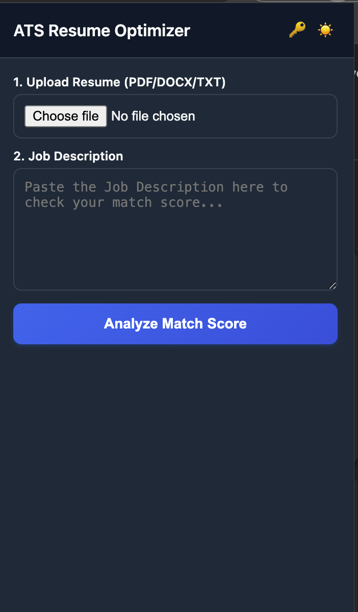
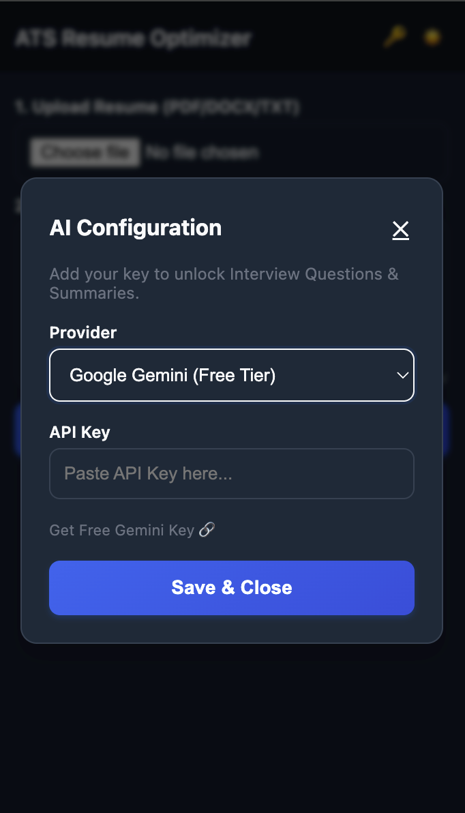

# 🚀 AI Interview Prep & ATS Resume Optimizer

**A Chrome Extension to optimize your resume for ATS visibility and generate real-time AI interview questions based on job descriptions.**


*(Place your screenshot in the `screenshots` folder and name it `demo.png`)*

## ✨ Features

*   **📄 Offline ATS Match Score**: Instantly analyzes your resume against any job description to calculate a match score. completely private & offline.
*   **🔑 Bring Your Own Key (BYOK)**: Connect your own AI provider for enhanced features without monthly subscriptions.
    *   **Google Gemini** (Free Tier available)
    *   **OpenAI** (GPT-3.5/4)
    *   **Ollama** (Local LLMs for total privacy)
*   **🤖 AI Insights**:
    *   **Job Summary**: Get a quick breakdown of the role.
    *   **Interview Questions**: Generate specific technical and behavioral questions.
    *   **STAR Method**: (Coming Soon) Get help structuring answers.
*   **🎯 Smart Highlighting**: Identifies missing keywords and suggestions for improvement.

## 🛠️ Installation (Developer Mode)

1.  **Clone this repository**:
    ```bash
    git clone https://github.com/ameershahil18/ai-interview-prep.git
    ```
2.  Open **Chrome** and navigate to `chrome://extensions/`.
3.  Toggle **Developer mode** (top right corner).
4.  Click **"Load unpacked"**.
5.  Select the `ai-interview-prep-overlay` folder from this repository.

## 📸 Screenshots

| Match Analysis | AI Settings |
|:---:|:---:|
|  |  |

*(Add `analysis.png` and `settings.png` to your `screenshots/` folder)*

## ⚙️ Configuration

1.  Click the extension icon.
2.  Click the **Key Icon (🔑)** in the header.
3.  Choose your provider:
    *   **Gemini**: Get a free key from [Google AI Studio](https://aistudio.google.com/app/apikey).
    *   **OpenAI**: Use your platform API key.
    *   **Ollama**: Ensure Ollama is running (`ollama run llama3`).

## 🔒 Privacy

*   **Resume Data**: Your resume is parsed **locally** in your browser. It is NOT stored on any server.
*   **AI Data**: If you enable AI features, data is sent directly from your browser to your chosen provider (Google/OpenAI). 

## 🤝 Contributing

Pull requests are welcome! For major changes, please open an issue first to discuss what you would like to change.

## 📄 License

[MIT](https://choosealicense.com/licenses/mit/)